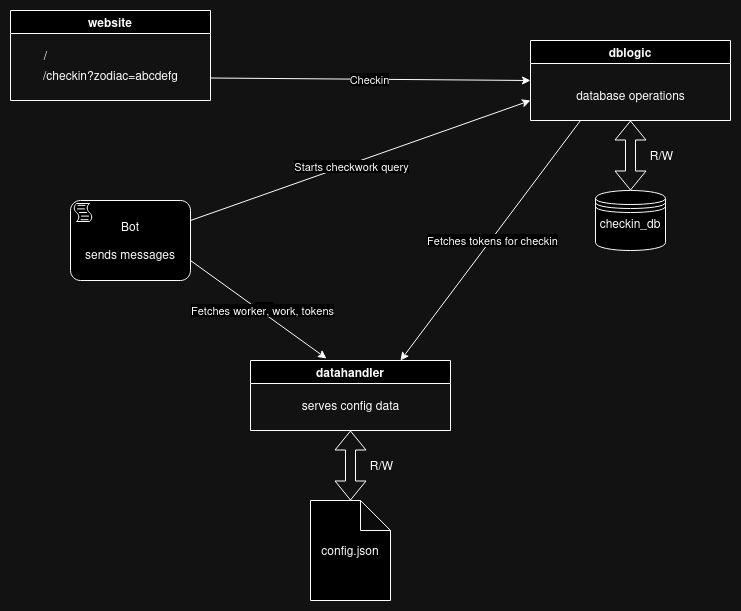

# Whatsapp Bot
Whatsapp Bot which sends the newly assigned house chores, reminders and more to your roommates defined in a config.json.

## Setup
#### Contact Names & Chores
Names of contacts need to stored as they are saved in Whatsapp. 
Names and chores are stored in the file config.json.

#### Authentication
When running the script for the first time you need to authenticate via the QR code afterwards everything needed is saved in a chrome profile locally,
which is then used to directly log in the next time. This works as long as you do not manually log out from your phone.

#### Simple Website
At / a beautiful relaxing website is served. Accessible via your public domain, if you bought one or otherwise over localhost.
It is run as a docker container on it's own and will be needed for roomates to checkin for work.

#### Docker Compose
The Bot will get its info from the containers and also feed data to th db via the containers.
These are handled with docker-compose.

#### Remarks
- WhatsappBot best runs as a cronjob in /etc/cron.d/bot as normal user
- Added some more options to avoid bot detection as well as some javascript.

#### Workflow Diagram

## TODO

| task                                                                                                                                                                   | status |
|------------------------------------------------------------------------------------------------------------------------------------------------------------------------|--------|
| Scrape wiki-how and then send a random link based on the chore on sunday as help :)                                                                                    | done   |
| We still need the checkin logic, a small script that checks on monday evening if the link was clicked and therefore the chore is done                                  | done   |
| make it accessible from the internet. IP is already linked with no-ip, but since we have a static IP, we could also buy a domain. and configure router to port-forward | done   |
| make it headless if profile exists and otherwise with head so you can scan the QR code.                                                                                | done   |
| Pack up everything nicely as a docker image, so that we don't have this awful permission chaos etc.                                                                    | done   |
| Harden the nginx proxy server inside the container -> change config file                                                                                               | done   |
| add SSL certs with certtbot                                                                                                                                            | done   |           
## Disclaimer
This project is not affiliated, associated, authorized, endorsed by, or in any way officially connected with WhatsApp or any of its subsidiaries or its affiliates. The official WhatsApp website can be found at whatsapp.com. "WhatsApp" as well as related names, marks, emblems and images are registered trademarks of their respective owners. Also it is not guaranteed you will not be blocked by using this method. WhatsApp does not allow bots or unofficial clients on their platform, so this shouldn't be considered totally safe.
